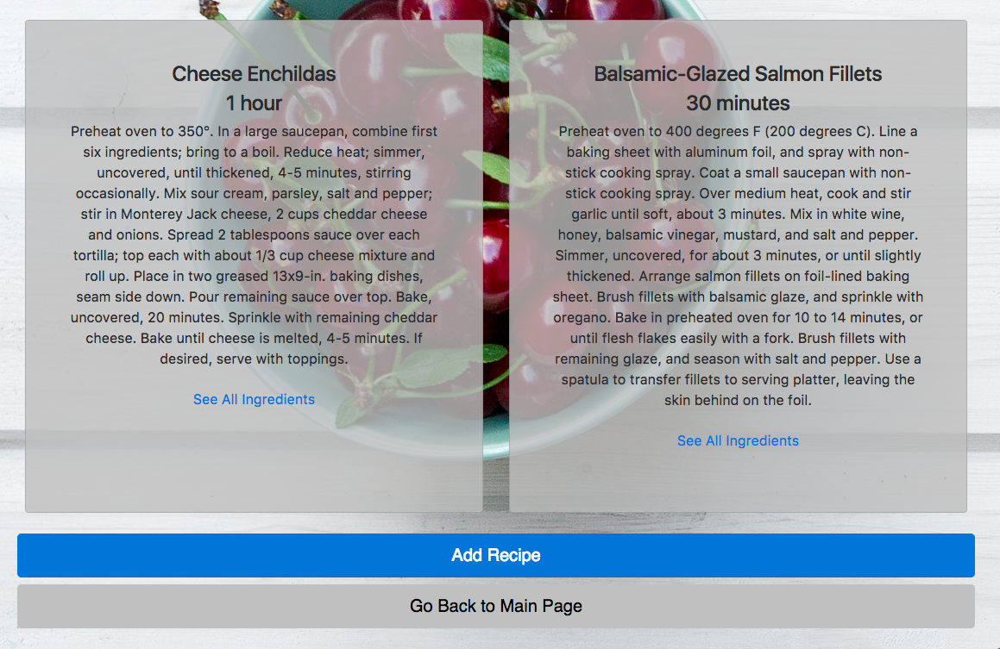
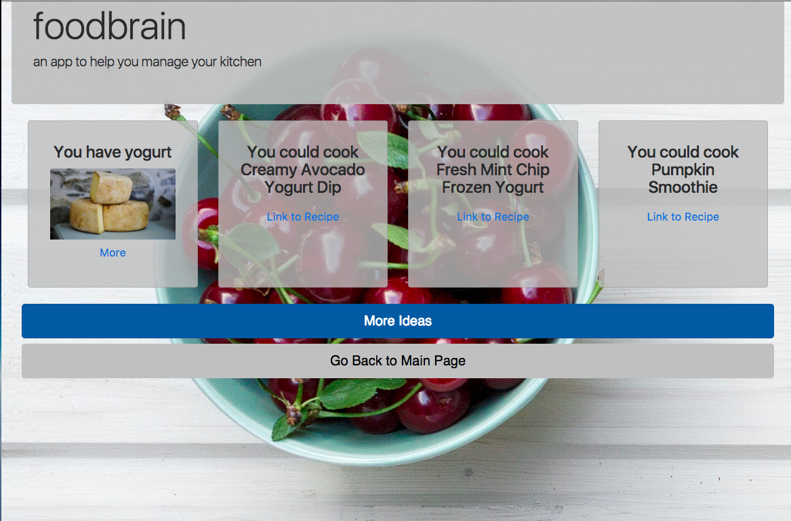

## foodbrain

Foodbrain is a food-and-recipe-management tool that helps you keep track of your food, so you don't have to think so much about what to cook. You can easily enter your foods into the app and get recipes recommendations based on your current foods.

See a demo at:
http://foodbrain.surge.sh/

* Browse recipes in your collection
* Get recipes recommendations based on foods that you already have
* Add and delete foods to change recommendations

### Installation

You can clone down this repo and run it from your machine. To see the back-end, you will have to check out this repo as well:
https://github.com/nathandpeterson/foodbrain-api
